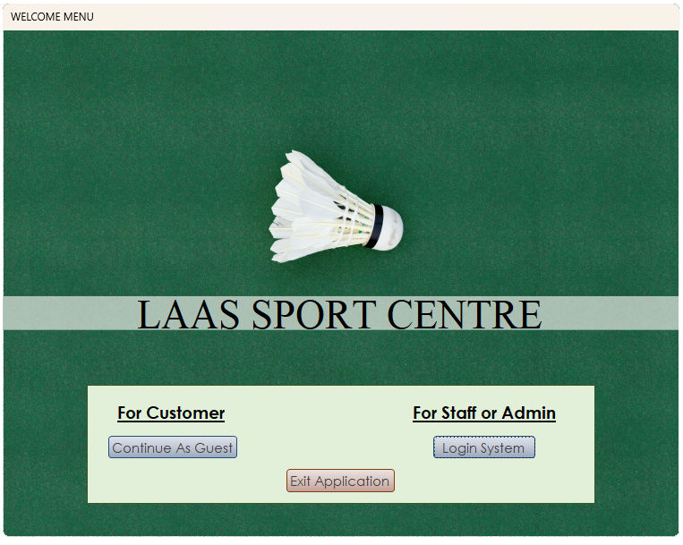
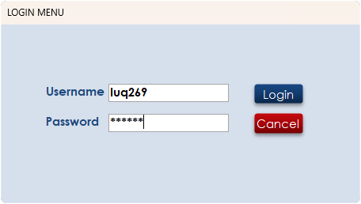
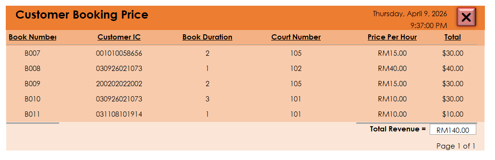
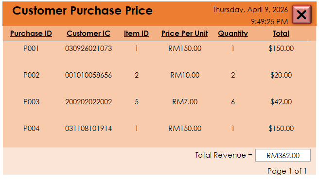
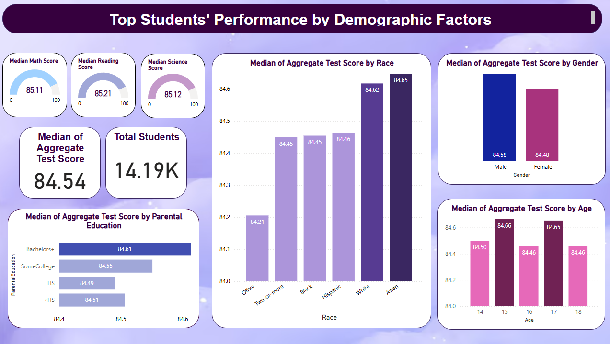
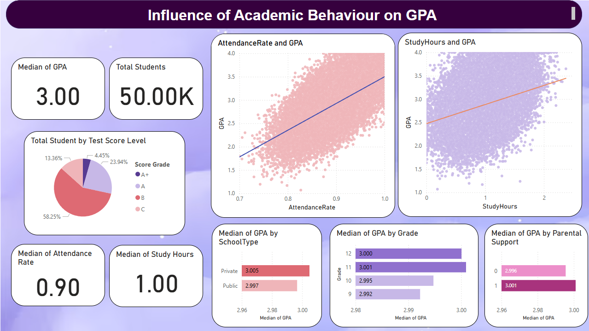
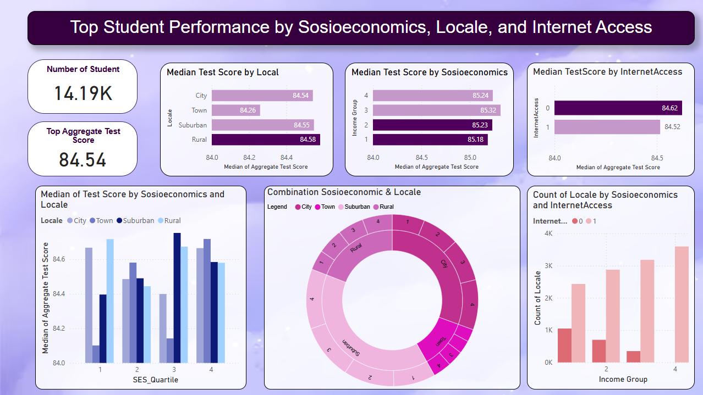

# Hi there, I'm Muhammad Luqman Hakim

### Mathematician / Data Analyst
A Mathematics graduate with a Big Data minor. My background in advanced mathematics, coupled with my experience in data analytics, allows me to efficiently tackle real-world business challenges. This portfolio showcases the skills mentioned below.

---

### My Skills

1.Microsoft Excel (Proficient)  
2.SQL (Intermediate)  
3.PowerBI (Proficient)  
4.Python (Intermediate)  

---

###  Featured Projects

####  Project Title: Managing Relational Database for Sports Centre (MS Access)

* **Features:** Login System using forms where only admin can edit entries. Customer only allowed to book/purchase.
  
* **Reports:** Revenue Reports and Booking grouped by Months
  

####  Project Title: Student Performance Analysis (Excel + PowerBI)

* **The Goal:** Identify the key factors that most significantly influence student performance.
* **The Data:** Using Data from Kaggle, cleaned using Excel and visualize in PowerBI as an interactive dashboard.
    
* **The Result:** Demographic factors, such as students' race and their parents' education, affect their performance the most.

---

###  Let's Connect
-  [Linked In](www.linkedin.com/in/muhammad-luqman-hakim-mohamed-ghazali-89545336b)
-  [Email](269luqmanhakim@gmail.com)
[TEST](www.google.com)
